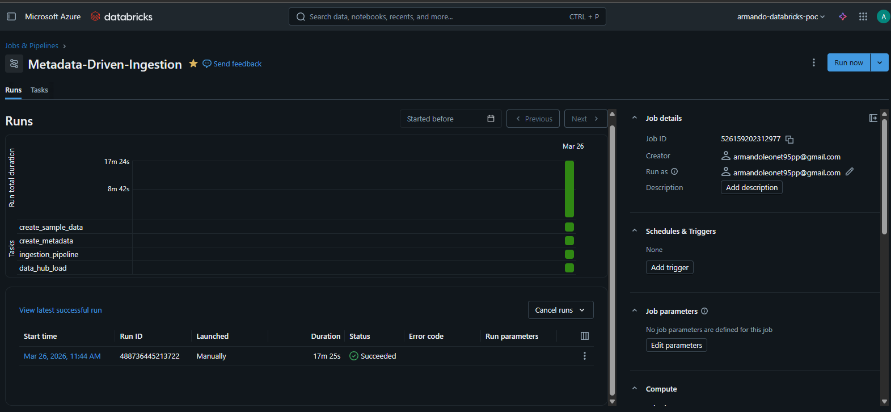
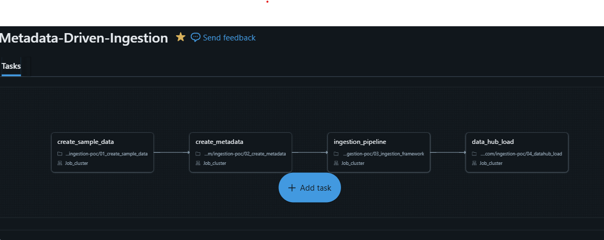

# Databricks job

## Overview

The ingestion pipeline is orchestrated using a Databricks job named:

**Metadata-Driven-Ingestion**

The job coordinates the execution of the notebooks in a sequential manner to ensure proper data flow across layers.

---

## job Tasks

The job consists of four tasks:

1. **create_sample_data**  
   Generates sample datasets (CSV and JSON) and stores them in the **landing** container.

2. **create_metadata**  
   Creates the ingestion configuration as a Delta table in the **metadata** container.

3. **ingestion_pipeline**  
   Reads metadata and copies source data into the **raw** layer without transformation.

4. **data_hub_load**  
   Loads data from the raw layer into the **datahub** layer in Delta format, adding audit columns.

### Why not Azure Data Factory (ADF)?

ADF could be used in a production scenario to orchestrate:
- Multiple services
- Cross-platform pipelines
- Scheduling and monitoring at scale

However, for this assignment:
- The scope is limited to Databricks
- Using jobs reduces complexity and setup time

## Notes

- The job is manually triggered for this PoC
- The pipeline is designed to be **idempotent**, as raw and datahub paths are cleaned before writing
---

## Screenshot

