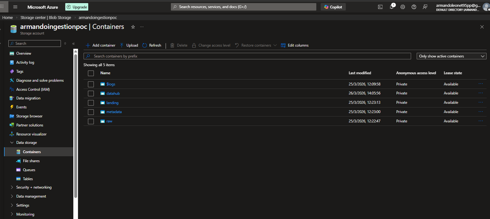

# Infrastructure Overview

## Overview

The solution uses Azure Data Lake Storage Gen2 (ADLS Gen2) as the storage layer for all data.

A single storage account is used with multiple containers representing different layers of the architecture.

---

## Storage Account

- **Type:** Azure Data Lake Storage Gen2
- **Access:** Configured via Databricks using `abfss://` protocol

---

## Containers

The following containers are used:

### 1. landing
- Simulates source systems
- Stores incoming data in original formats (CSV, JSON)

### 2. raw
- Stores an immutable copy of the source data
- Data is copied **as-is** from landing
- No transformations are applied

### 3. metadata
- Stores ingestion configuration
- Implemented as a Delta table
- Drives the ingestion framework dynamically

### 4. datahub
- Stores curated data in Delta format
- Data is enriched with audit columns
- Designed for analytical consumption

---

## Layered Architecture

- **Landing:** Source simulation
- **Raw:** Immutable copy of source data
- **Data Hub:** Curated, queryable layer

---

## Design Decisions

### Separation of Containers

Each layer is stored in a separate container to:
- Enforce clear separation of concerns
- Improve data organization
- Align with common lakehouse architecture patterns

### Raw Layer Behavior

The Raw layer:
- Preserves original file formats
- Enables reprocessing and traceability
- Avoids early transformations

### Data Hub Layer

The Data Hub:
- Standardizes data into Delta format
- Adds audit columns:
  - ingestion timestamp
  - source name
- Serves as the main analytical layer

---

## Screenshots

